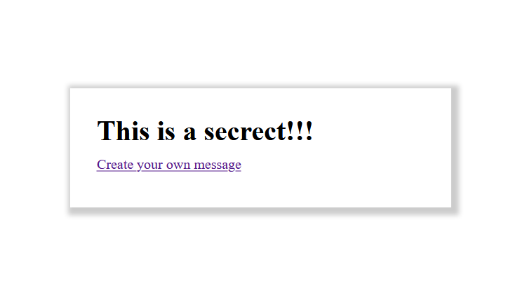

<!-- PROJECT LOGO -->
 
<h3 align="center">Secret Messaging App</h3>
 

### About The Project

App that allows you to type in a secret msg and it encrypts the message into a link that can be shared to a friend. Upon entering the given url the message is decoded from the link and displayed in it's original form. Purpose of this is app is to practice placing data in url hash and also manipulating that hash to place into DOM. App is hosted using Vercel. https://secret-messaging-app.mirand32.vercel.app/

### Built With

This section should list any major frameworks that you built your project using. Leave any add-ons/plugins for the acknowledgements section. Here are a few examples.
* [Javascript]
* [HTML]
* [CSS]

